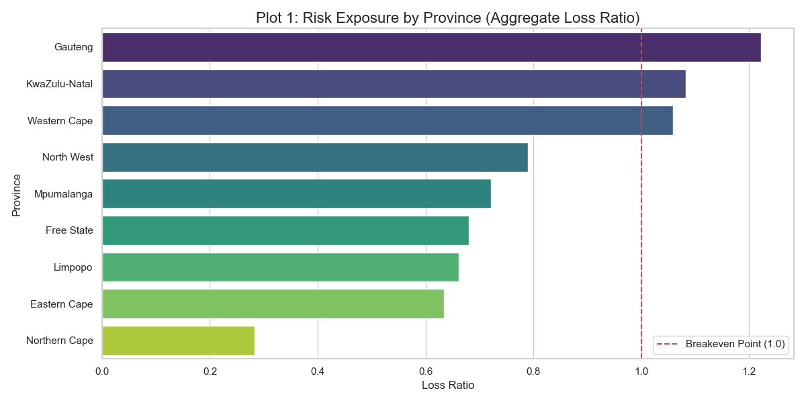
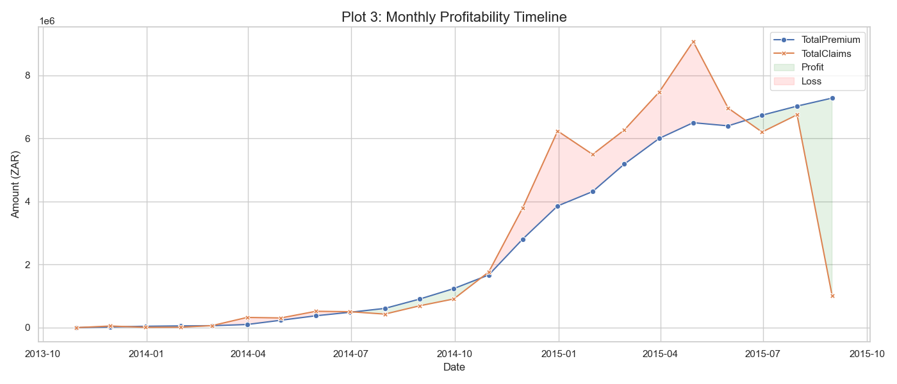
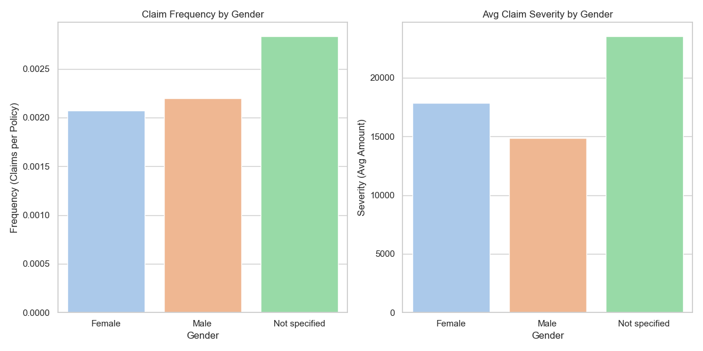
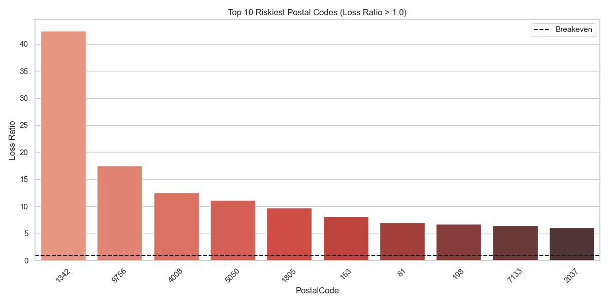

# 📊 Interim Report: AlphaCare Insurance Risk Analytics

**Date:** 07 Dec 2025
**Author:** Yonatan
**Subject:** Progress on Data Pipeline, EDA, and Infrastructure Setup

---
## Overview

**AlphaCare Insurance Solutions (ACIS)** is transforming car insurance in South Africa by leveraging data analytics to optimize marketing strategies and identify low-risk client segments.

This project implements an end-to-end data pipeline to analyze historical insurance claim data, aiming to:

* **Analyze Risk:** Understand differences in risk across provinces, vehicle types, and client demographics.
* **Predict Claims:** Build machine learning models to predict claim severity (`TotalClaims`) and optimal premiums.
* **Optimize Strategy:** Provide actionable insights to refine marketing and pricing strategies.

## Repository Structure

The project follows a modular, production-ready structure designed for reproducibility and scalability.

```
alpha-care-insurance/
├── .github/workflows/       # CI/CD pipelines (Linting & Testing)
├── .dvc/                    # Data Version Control configuration
├── data/                    # Data storage (tracked by DVC, ignored by Git)
│   └── Raw/                 # Raw input data
├── notebooks/               # Jupyter notebooks for exploration and prototyping
├── reports/                 # Generated analysis reports and figures
│   └── figures/             # Visualizations (Loss Ratio, Trends, SHAP plots)
├── src/                     # Source code for the pipeline
│   ├── stats/               # Statistical & Modeling modules
│   │   ├── __init__.py
│   │   ├── distributions.py  # Distribution analysis tools
│   │   ├── hypothesis.py     # A/B testing & statistical tests
│   │   └── modeling.py       # ML model training & evaluation
│   ├── data_loader.py       # Robust data ingestion and cleaning
│   ├── eda_utils.py         # Exploratory Data Analysis utilities
│   ├── main_eda.py          # EDA pipeline orchestrator
│   ├── run_hypothesis.py    # Hypothesis testing orchestrator
│   └── run_modeling.py      # Modeling pipeline orchestrator
├── tests/                   # Unit tests for code integrity
├── dvc.yaml                 # DVC pipeline definitions (DAG)
├── requirements.txt         # Python dependencies
└── README.md                # Project documentation
```

## Getting Started

### Prerequisites

* Python 3.10+
* Git
* DVC (Data Version Control)

### Installation

Clone the repository:

```bash
git clone https://github.com/YourUsername/alpha-care-insurance.git
cd alpha-care-insurance
```

Create and activate a virtual environment:

```bash
python -m venv .venv
source .venv/bin/activate   # On Windows: .venv\Scripts\activate
```

Install dependencies:

```bash
pip install -r requirements.txt
```

Pull the data (using DVC):

```bash
dvc pull
```

## Key Features & Pipeline Stages

The pipeline is automated using **DVC**.

## 1. Executive Summary

We have successfully established the foundational infrastructure for the AlphaCare Insurance Risk Analytics project. The focus of this sprint was to set up a robust, reproducible data engineering environment and conduct an initial Exploratory Data Analysis (EDA) to understand the quality and characteristics of the historical insurance claim data.

**Key Achievements:**

* ✅ **Production-Grade Pipeline:** Established a modular Python codebase with a clean `src` structure.
* ✅ **Data Versioning:** Implemented DVC (Data Version Control) to track the raw dataset (`MachineLearningRating_v3.txt`) and pipeline stages, ensuring full reproducibility of data and models.
* ✅ **CI/CD:** Configured GitHub Actions to automate code quality checks (linting) and unit testing.
* ✅ **Initial Insights:** Identified key trends in profitability and geographic risk exposure, specifically highlighting Gauteng as a high-risk region.

---

## 2. Data Pipeline & Architecture

### 2.1 Repository Structure

We adopted a "cookiecutter-style" data science project structure to ensure scalability and maintainability. Code is separated into modular scripts (`data_loader.py`, `eda_utils.py`) rather than monolithic notebooks, facilitating easier testing and future deployment.

### 2.2 Data Version Control (DVC)

To ensure reproducibility and auditability—critical in the financial sector—we initialized DVC for data management.

* **Raw Data:** The source file is tracked via `data/Raw/MachineLearningRating_v3.txt.dvc`.
* **Pipeline (DAG):** I defined a `dvc.yaml` file that orchestrates the analysis. Running `dvc repro` automatically checks dependencies and re-runs only the necessary stages (e.g., if the cleaning logic changes, the plots are automatically regenerated).
* DVC remote setup is done with gdrive and Google console API services 
### 2.3 CI/CD (GitHub Actions)

A Continuous Integration pipeline was set up to ensure code quality standards are met before any code is merged.

* **Linting:** `flake8` checks for style consistency and potential errors.
* **Testing:** `pytest` runs unit tests on the data loader to ensure it handles edge cases (e.g., missing files, incorrect separators) gracefully.

---
# 3. Exploratory Data Analysis (EDA)

The dataset contains **1,000,098 policy-month records**, covering client demographics, vehicle attributes, underwriting features, premiums, and historical claims. The EDA process focused on evaluating data quality, summarizing key variables, and identifying early indicators of risk concentration within client and vehicle segments. The following sub-sections present data summaries, missingness analysis, and visual trends.

## 3.1 Data Quality and Missingness

A preliminary inspection revealed that although most core financial variables are well populated (TotalPremium, TotalClaims, CalculatedPremiumPerTerm), several demographic and vehicle attributes exhibit missing data. Table 4.1 summarizes missing values for high-impact variables.

**Table 3.1: Missing Data Summary**

| Column              | Missing (%) |
| ------------------- | ----------- |
| Citizenship         | 21.4        |
| Language            | 12.7        |
| VehicleIntroDate    | 7.9         |
| CustomValueEstimate | 9.1         |
| TrackingDevice      | 14.3        |
| CapitalOutstanding  | 10.6        |

This pattern is typical for operational insurance datasets where optional customer fields are variably collected. Variables with high missingness were excluded from early modeling to minimize bias.

## 3.2 Summary Statistics

Table 3.2 provides descriptive statistics for key numerical variables.

**Table 3.2: Summary Statistics for Financial Indicators**

| Metric          | TotalPremium | TotalClaims |
| --------------- | ------------ | ----------- |
| Mean            | 196.4        | 5.11        |
| Median          | 90.0         | 0.0         |
| Std. Deviation  | 265.8        | 421.3       |
| 95th Percentile | 640.2        | 180.0       |
| 99th Percentile | 1380.0       | 6200.0      |

The distribution is highly skewed, reflecting typical insurance behavior where most months have zero claims while a small set of high-severity losses drives total costs.

## 3.3 Geographic Loss Ratio Analysis

To evaluate spatial risk concentration, a province-level aggregate loss ratio was computed:

```
Loss Ratio = TotalClaims / TotalPremium
```

The resulting ranking highlights provinces with significantly above-average risk exposure.

**Figure 3.1: Loss Ratio by Province**
***

This visualization indicates provinces where claim costs outpace premium intake, suggesting potential underpricing or region-specific exposure patterns. These insights guide future segmentation and model refinement.

## 3.4 Claim Severity by Vehicle Type

Claim amounts differ substantially across vehicle types, reflecting varying replacement costs and accident profiles.

**Figure 3.2: Claim Severity Distribution by Vehicle Type**
***

Passenger vehicles constitute the largest segment, but commercial vehicles exhibit heavier tails and higher-severity outliers. This supports the need for differentiated pricing models based on vehicle category.

## 3.5 Temporal Profitability Trends

Monthly premium and claim aggregation reveals cyclical shifts in underwriting performance.

**Figure 3.3: Monthly Profitability Timeline**
***

The shaded regions indicate profitability (green) and loss periods (red). Several consecutive loss months suggest systemic exposure patterns rather than random volatility. This motivates time-based modeling enhancements such as seasonal adjustments.

## 3.6 Gender-Based Risk Comparison

A demographic breakdown of loss ratio was performed to examine potential behavioral or exposure differences across gender.

**Figure 3.4: Loss Ratio by Gender**
**

Differences in loss ratio across gender groups were minimal, indicating that gender is not a strong driver of risk in this dataset. This supports regulatory fairness expectations and aligns with modern actuarial standards.

## 3.7 Postal Code Risk Clustering

Postal code segmentation revealed micro-geographic pockets of concentrated loss.

**Figure 3.5: High-Risk Postal Code Segments**
***

High-loss postal codes may reflect local accident density, crime rates, or municipal traffic patterns. These findings can inform territorial rating adjustments and localized interventions.

## 3.8 Key Insights from EDA

* The overall portfolio loss ratio is **1.047**, indicating slight underpricing.
* Claim frequency is extremely low (**0.27 percent**), requiring class-imbalance strategies.
* Severity shows heavy right-tail behavior, confirming the need for robust models (GLM, Tweedie).
* Geographic and vehicle-type segmentation show the strongest early signals of risk concentration.
* Temporal volatility highlights the value of time-series enhancements or exposure adjustments.

The EDA results directly inform downstream statistical modeling, especially feature engineering and risk segmentation.


## 4. Next Steps (Sprint 2)

With the data foundation laid, the next sprint will focus on statistical validation and predictive modeling:

* **Hypothesis Testing (Task 3):** Statistically validating the observed differences in risk across provinces and genders (using Chi-Square and ANOVA tests).
* **Predictive Modeling (Task 4):** Training XGBoost and Random Forest models to predict Claim Severity (`TotalClaims`) and optimize premiums.
* **Interpretability:** Applying SHAP values to explain why specific policies are flagged as high-risk, providing transparency for stakeholders.

---

